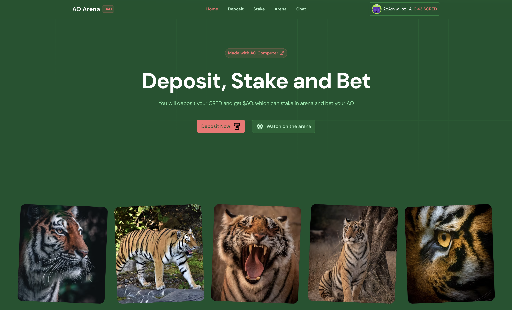
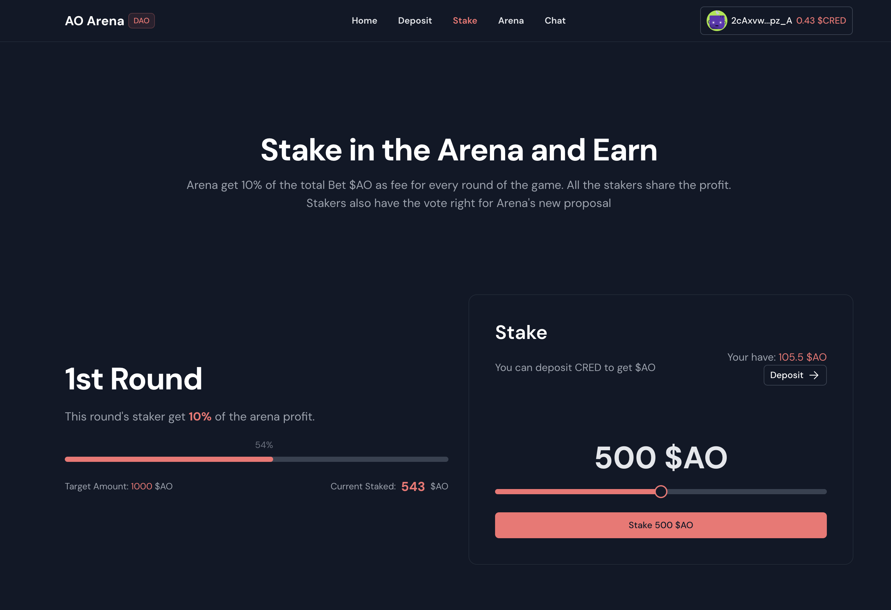

# AO Arena DAO

[](https://ui.nuxt.com/pro?aff=KokMD))


It was fascinating when I first saw the [AO Launch Video](https://twitter.com/aoTheComputer/status/1762545634035290465).

Then I spend most of my time studying and trying AO.

Also, make the [Awesome AO](https://github.com/HelloRWA/awesome-ao).

During the weave hackathon, I first built the Inbox UI for track 1(Build a Fullstack Permaweb App), then built the game UI to reading && pull data from the ao arena for track 3(Build a Graphical User Interface for ao-Effect). Finally, come to the Track 4 task(The MemeFrame Championship).

Then I found I could combine all of them into one: `AO Arena DAO`.

1. User deposit CRED to get $AO Coin
2. User stake $AO Coin to the Arena, earn 10% profit share, vote for proposal in the DAO
3. User Bet on the players, once the side you bet on wins, you get the reward $AO Coin(Which comes from the failure side)
4. Arena takes 10% as the game fee, and 10% of the game fee share to all the stakers.
5. User can watch the players' moving and fighting on the `/arena`, which reads the data from the arena process

## Links

* [Web App](https://ao.rwa-wallet.com/)
* AO Process List
  * [Arena](https://www.ao.link/message/uLPuyonDbrhNMwL9UA04H9H4dLLE9iPdE0ESAjrWAqs)
  * [$AO Coin](https://www.ao.link/message/rxl5oOyCuzrUUVB1edjrcHpcn9s9czhj4rsq4ACQGv4)
  * [Deposit Service](https://www.ao.link/message/kzcVZhdcZOpM90eeKb-JRX3AG7TGH__S7p5I6PsqA3g)
  * [AI Player 1](https://www.ao.link/message/QcJD9Fzq-gg4LIBHsQs61eTpvlGojW_tg61Il0mp8TI)
  * [AI Player 2](https://www.ao.link/message/SkAPEpHCnB3GC8x5yoYMhaOx09G9H--YbzSoOLs4S9U)


## Features


### Deposit

* [x] User deposit CRED to get $AO
* [x] Launch the [$AO Coin](https://github.com/HelloRWA/Web3-FullStack-Starter/blob/main/ao/game/tokenAO.lua#L97-L145) with customized transfer logic to support `Stake` and `BetOn` logic
* [x] Make a [deposit service process](https://github.com/HelloRWA/Web3-FullStack-Starter/blob/main/ao/game/deposit.lua) to support this
* [] `WIP` Make a `Deposit Activity` List



### Stake

* [x] User stake $AO Coin to [earn arena profit share](https://github.com/HelloRWA/Web3-FullStack-Starter/blob/main/ao/game/arena.lua#L208)
* [x] Customize the Arena code to support [stake logic](https://github.com/HelloRWA/Web3-FullStack-Starter/blob/main/ao/game/arena.lua#L424-L460)
* [ ] `WIP` Make a `Stake Activity` List
* [ ] `WIP` User can vote for arena proposal


### Arena

* [x] User can watch the two players fight on the [web page](https://github.com/HelloRWA/Web3-FullStack-Starter/blob/main/components/game/warGround.vue)
* [x] User can [bet on](https://github.com/HelloRWA/Web3-FullStack-Starter/blob/main/pages/arena.vue#L33-L51) any players while in `Waiting` game mode`
* [ ] `WIP` Optimize the bot code to improve bot's AI
* [ ] `WIP` User can burn $AO token to own their Arena and get profit by operating their own Arena
* [ ] `WIP` User can burn $AO token to own their bot player


### Chat

User can add process, and send / receive the process's new message

* [x] add [new process](https://github.com/HelloRWA/Web3-FullStack-Starter/blob/main/components/inbox/NewBtn.vue)
* [x] process [msg list](https://github.com/HelloRWA/Web3-FullStack-Starter/blob/main/components/inbox/InboxMail.vue)
* [x] show avatar by the pid/msgId seed via [Bottts Neutral](https://www.dicebear.com/styles/bottts-neutral/)
* [x] [send message](https://github.com/HelloRWA/Web3-FullStack-Starter/blob/main/components/inbox/InboxMail.vue#L32-L52) to process
* [x] [play notification sound](https://github.com/HelloRWA/Web3-FullStack-Starter/blob/main/components/inbox/InboxListMessage.vue#L32-L38) while new message arrived (interval with 5 seconds)
* [x] [load more](https://github.com/HelloRWA/Web3-FullStack-Starter/blob/main/components/inbox/InboxMail.vue#L56-L62) while scroll to top(which will load older msg)

## Credits

* Nuxt UI/ Nuxt UI Pro : [Click here](https://ui.nuxt.com/pro?aff=KokMD)
* [aos unbox](https://github.com/mayurmarvel/aos-unbox)
  * Notification Sounds : [Click here](https://notificationsounds.com/)
  * Dice Bear Avatars : [click here](https://www.dicebear.com/styles/bottts-neutral/)


## Quick Start

```bash [Terminal]
git clone git@github.com:HelloRWA/Web3-FullStack-Starter.git
```

## Setup

Make sure to install the dependencies:

```bash
# npm
npm install

# pnpm
pnpm install

# yarn
yarn install

# bun
bun install
```

## Development Server

Start the development server on `http://localhost:3000`:

```bash
# npm
npm run dev

# pnpm
pnpm run dev

# yarn
yarn dev

# bun
bun run dev
```

## Production

Build the application for production:

```bash
# npm
npm run build

# pnpm
pnpm run build

# yarn
yarn build

# bun
bun run build
```

Locally preview production build:

```bash
# npm
npm run preview

# pnpm
pnpm run preview

# yarn
yarn preview

# bun
bun run preview
```

Check out the [deployment documentation](https://nuxt.com/docs/getting-started/deployment) for more information.
